# Shivam Panchal

---

Hi there, **I am Shivam**

I am a **Bachelor of Technology** from ***Harcourt Butler Technological Institute***, Kanpur.

 
I have been working as a Data Science Consultant from past 3 years in the field of Data Analysis & Data-Driven Decision Making, Statistical Analysis Techniques, Machine Learning and Deep Learning Modelling, Computer Vision and Natural Language Processing.

 
I have worked across various domains such as Banking and Finance, Healthcare and Telecom. Information and Knowledge is power in business, and data is the fuel that creates this power. I help my clients to grow by harnessing the power of data in their organizations and building products and solutions by extracting knowledge from their data and leveraging this data to take major decisions to a business problem.  

I have a profound interest in Data Science, Artificial Intelligence and Internet of Things. I love to code and travel. I love all breeds of dog. 

[Email](mailto:shivam.panchal@mail.com) [LinkedIn](http://linkedin.com/in/panchalshivam)  [Twitter](http://twitter.com/reach_shivam) [GitHub](http://github.com/shivampanchal)

---

## Experience

**Freelance Consultant**  
__Data Scientist__ 
July 2018 - November 2019  

I worked across various domains such as Banking, Finance, Healthcare and Telecom, working with various Start-ups and Individual Clients
- Involved in gathering requirements while uncovering and defining multiple dimensions of the Project.
- Extracting data from one or more sources for analysis.
- Working closely with cross functional teams to encourage statistical best practices with respect to experimental design and data analysis.
- Accomplished multiple tasks from collecting data to organizing data and helping in data-driven decision making.
- Implementing Machine Learning and Deep Learning algorithms for supervised and unsupervised learning.
- Build Machine learning and Deep Learning pipelines with end-to-end ETL processes with SQL/NoSQL databases.
- Provide consulting and advise clients on Advance Machine Learning and Deep learning solution implementation.

**GLS** 
__Data Scientist__ 
Sep 2018 - Nov 2019

- Deep Learning based Forecasting Models, Churn Prediction
- Chat bots and Natural Language Processing
- Integration of a Data Visualization and Reporting with Process Work Flow.

**S1Bit** 
__Data Scientist__ 
Sep 2018 - Nov 2019 

- Stock Analysis and Time Series Analysis
- Building Hybrid Machine Learning and Deep Learning based forecasting model
- Integration of a Data Visualization and Reporting with Process Work Flow.

**Sancoj** 
__AI Developer__ 
Mar 2018 - Nov 2019 

Worked on world’s first opportunity supermarket built on the Ethereum Blockchain and powered by Artificial Intelligence using transfer Learning and Natural language Processing.

**MathLogic** 
__Data Science Analyst__ 
Jun 2017 - Mar 2018 

- Data Insights and Reporting over multiple sources of data using Postgre SQL and Report Server.
- Daily Scripts / APIs / Services for reporting mails and alerts for all Google ODK for AUSFB - Insurance Data.
- Data Visualizations for Data Analytics across all verticals using Tableau
- Learning Module Development for Deep Learning (Keras+Tensorflow)

---

## Skills
### Technical Skills
* **Databases**: SQL Server, MySQL, SQLite, PostgreSQL, MongoDB 
* **Programming**: SQL, Python, Colab, Jupyter Notebook, Django, R, HTML
* **Operating Systems**: Windows, Linux
* **BI Tools**: Tableau, Power BI, Qlik, Google Data Studio 
* **Technologies**: OpenCV, TensorFlow, Theano, Keras, Scikit, Numpy, Pandas, YOLO, CUDA, Matplotlib, Plotly, GIT, AWS, GCP
* **Areas of Expertise**: Data Cleaning and Munging, Database Management and Warehousing, Statistical Analysis, Ad-hoc Reporting, Data Analysis, Data Visualization, Business Intelligence, Machine Learning and Deep Learning, Transfer Learning
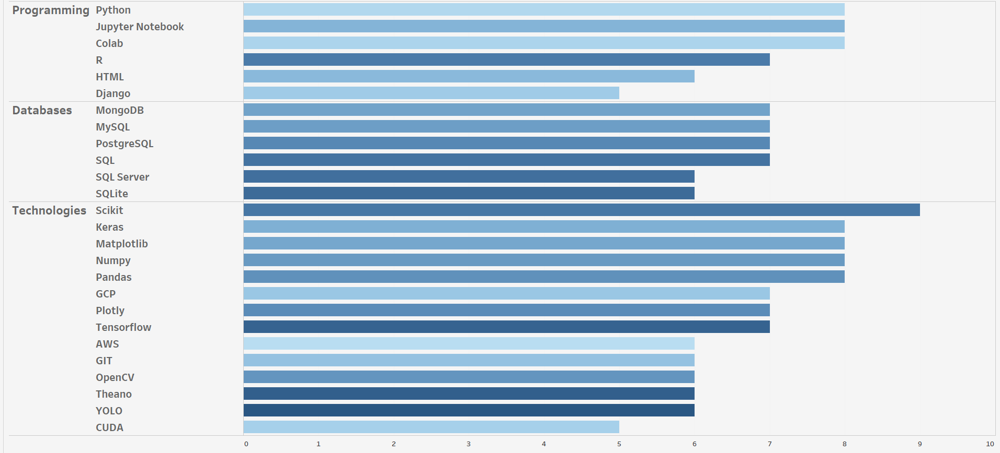
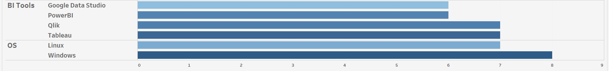

### Soft Skills
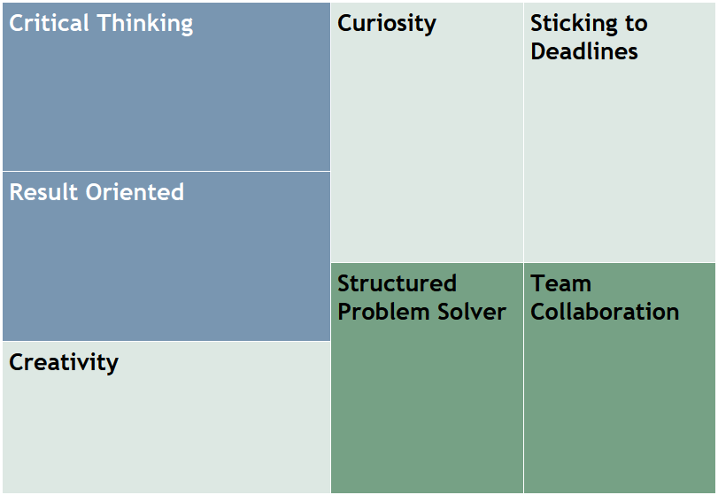

### Other Background Information

- Experienced in building end-to-end pipelines for Data manipulation, Modelling, Model selection and Prediction
- Knowledge of a variety of Data Visualizations in Matplotlib, Plotly, Dash, Tableau and R Shiny, Plotly, QlikSense.
- Statistical Analysis
- Knowledge of a variety of machine-learning algorithms like:
- Regression (Linear, Logistic Regression, Multiple, GLM, Trees based Regression)
- Dimension Reduction Methods (Principal Component Analysis, LDA)
- Classification (Naive Bayes, Support Vector Machine, Logistic regression, Decision trees, Ensembles - Random forests, Gradient Boosting, Adaboost, XGBOOST, CATBOOST)
- Clustering- K Means/ hierarchical/DBSCAN/Affinity/Agglomerative/Spectral)
- Expert in Tensorflow/Theano/Keras/Pytorch Frameworks: 
--       Classification (AlexNet/GoogleNet/ResNet/VGGs)
--       Object Detection (R-CNN, YOLO, RESNEXT)
--       GANs
- Image Processing, Time Series Analysis
- Database Management System- MySQL, MongoDB
- Natural Language Processing and Text Analysis, Sentimental Analysis, Aspect Based, POS Tagging, Named Entity Recognition, Advanced text Classification using Deep Learning methods, Chatbots and DialogueFlow
- Additional Tools - RapidMiner, WEKA, KNIME, TRIFECTA, Qlik, SASMiner, Excel, Tableau, Splunk, GIT, AWS, GCP
- Mainstream Language - Python, R

---

## Education

__Harcourt Butler Technical Institute__  
Bachelor of Technology  
`2013-17` 

- Learning and Practicing Data Science and Machine Learning, completing courses and earning certificates and specializations to excel in in the field. 
  -I was also engaged in Event Organization, Seminar Management, Resource Generation, Marketing, Debates, Quiz and Paper Presentation in my college. 

__Silver Bells Public School__  
Senior Secondary School 
`2010-12` 
- Physics and Mathematics, SOF, NSS, Football.

---

## Publications

**Careers after 10th&12th** 
July 2014 

  The goal of this book is to guide the students in choosing the right career after school and providing a lot of career options from which they can choose one, of their own interest. In addition to empowering and guiding the student towards the right career, this book is also dedicated to providing detailed information on various career options, courses, and colleges in India which help the students know a career in details and make an informed choice. 

[Download E-book](https://www.dropbox.com/s/r1309zkugd4is3f/Careers%20after%2010th%20and%2012th.pdf?dl=0)

---

## Certifications

**Data Science Specialization (9 courses)** 
__Coursera (John Hopkins University)__ 
[View Certificates](https://www.dropbox.com/sh/bd6bp71w3elzqas/AADIRfPrD7xQSZbxxVJekakma?dl=0)  
The specialization consists of nine courses. 
- Data Scientist Tool Box
- R Programming 
- Getting and Cleaning Data
- Exploratory Data Analysis
- Statistical Inference
- Reproducible Research
- Regression Models
- Practical Machine Learning
- Developing Data Products 

**Big Data Specialization (4 courses)** 
__Coursera (University of San Diego)__ 
[View Certificates](https://www.dropbox.com/sh/qqvob70eeuu381w/AAARe_DZqCjIlS8glbbywQgxa?dl=0)  
- Introduction to Big Data, Hadoop and its Ecosystem (HDFS and Map Reduce) 
- Apache Spark and its components 
- Graph Analytics with Neo4j and handling of data in KNIME and Splunk 

**Machine Learning Specialization (3 courses)**  
__Coursera (University of Washington)__ 
[View Certificate](https://www.coursera.org/account/accomplishments/certificate/P3MCM8N7H8BH)  
- Introduction to Machine Learning 
- Regression, Classification and Clustering 

**Data Science and Machine Learning Essentials** 
__Microsoft__  
`2015`
[View Certificate](https://courses.edx.org/certificates/6705637ab3eb487ea3f3dc11bfc197bd)  
- Data Cleaning, EDA and Model Building and Evaluation. 
- Data Analysis in Python, using various libraries. 
- Numpy, Matplotlib, Seaborn, sklearn, Caret etc. 

----

## Projects

__Vehicle Number Plate Reading__
- This project is used to detect the images of the vehicle license number plate, convert that license number plate code identified to text and store the data in system with date and time of vehicle and the identified number on number plate. This application can be used in parking areas to keep track of every vehicle and make parking process easier.  
- Dependencies – OpenCV, Tesseract 4 

__Traffic Rule Violation Detection System__
- This project tries to detect a car whenever it passes a Red Light or over speeds. Based on TensorFlow to detect cars and from the detections in each frame each vehicle can be tracked across a video and can be checked if it crossed a red light and speed of that vehicle can be calculated.
- Dependencies: TensorFlow-GPU, OpenCV, IMutils, Pillow, Numpy, TKinter, OpenALPR API

__Stock Trading Tool__
- This project allows users to access real-time stock prices to simulate the trading strategies of stocks within a portfolio and look buy and sell options.

__Image Captioning and Medical Report Generation__
- This project allows the user to scan an X-ray image and expect it to display the diseases in the lungs out of the 14 categories and then generate the medical report of the patient. In this way, this application reduces the scope of a Radiographer in clinical laboratories.

To know about about my other works and projects, please let me know on Email.

---

## Recommendations
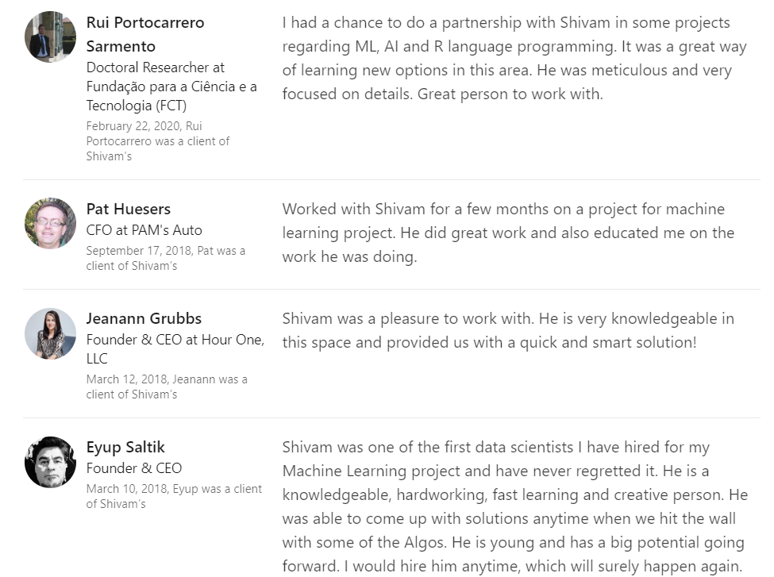

### Freelance Clients's Reviews and Profile

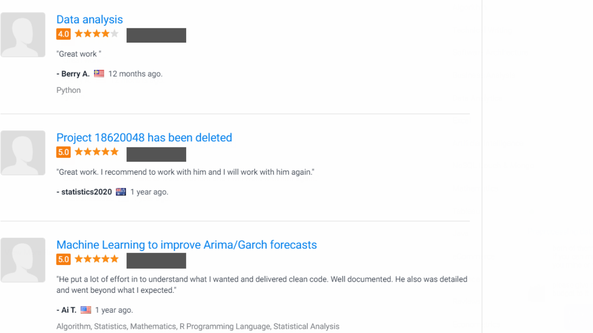
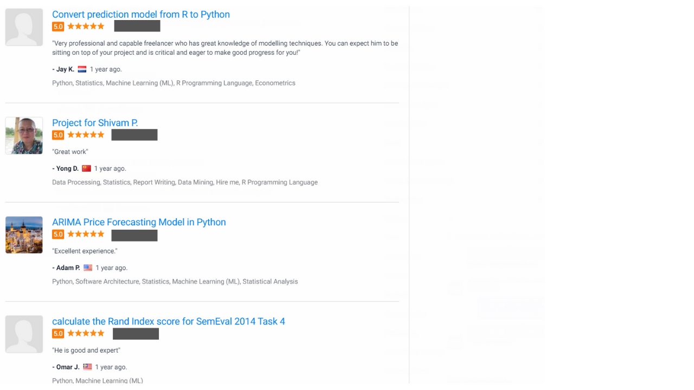
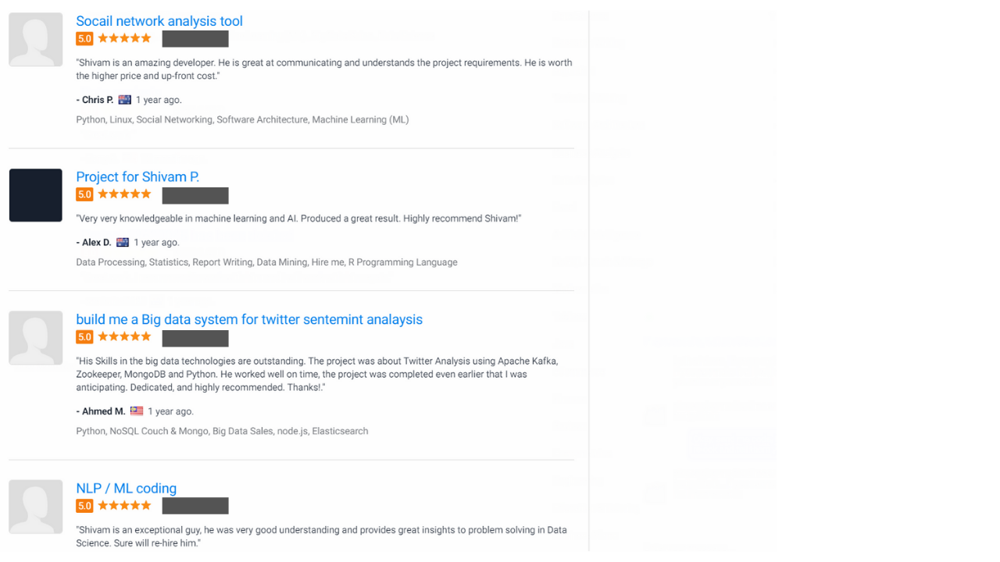
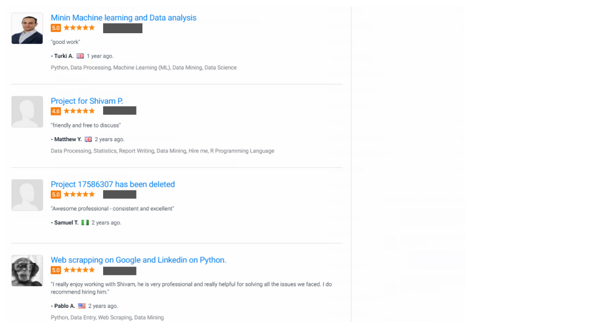
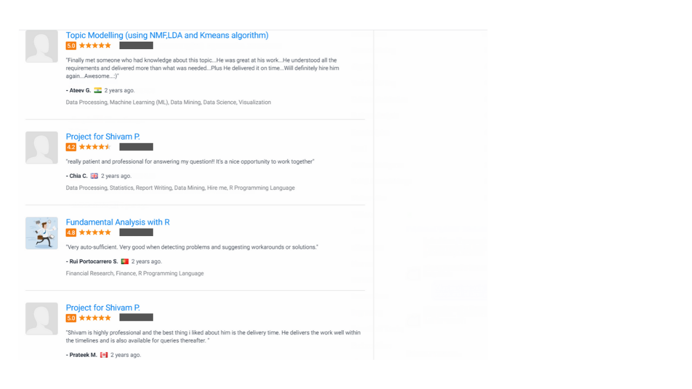
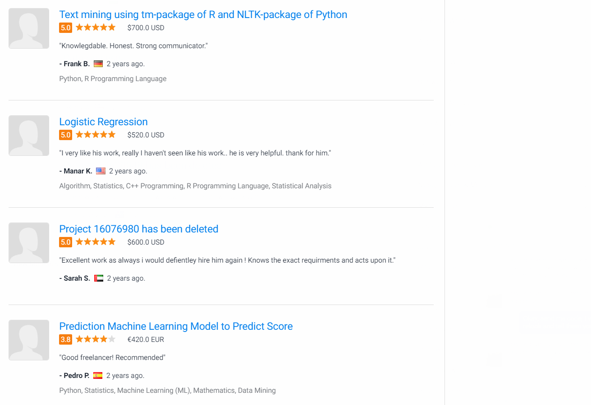
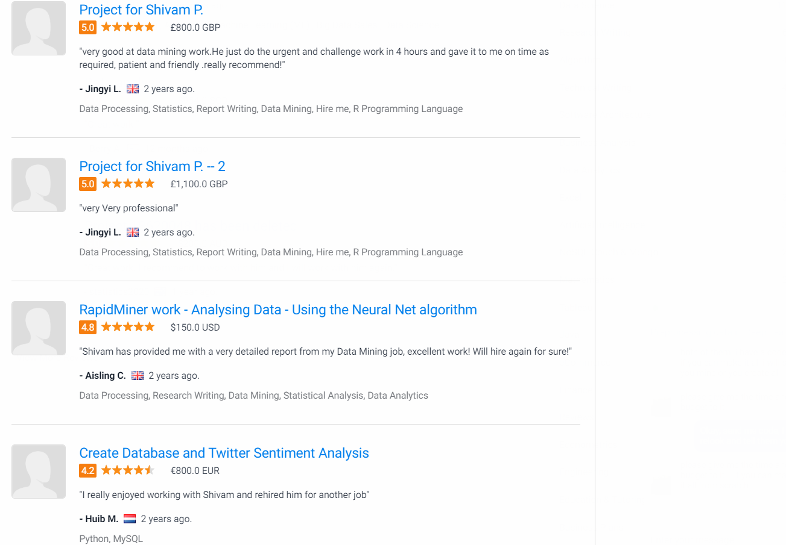
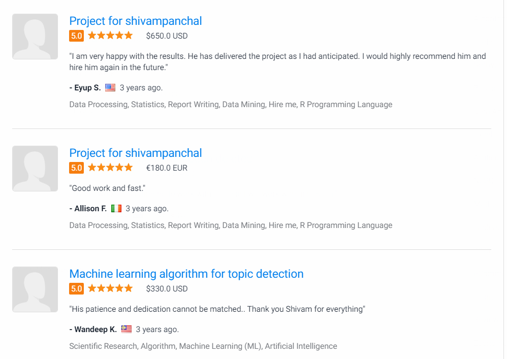
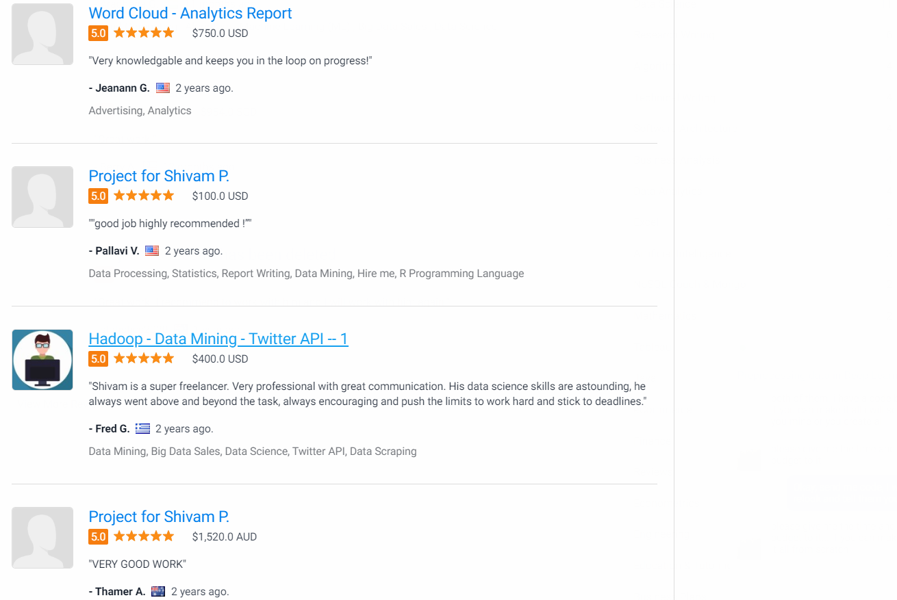

Want to Hire me for your project or view my full Freelancer Portfolio, please drop me an email.

---

## References

Available on request. 

<!-- ### Footer

Last updated: Feb 2020 -->

---

## Contact me

Please drop an E-Mail .

[Email](mailto:shivam.panchal@mail.com) 
[LinkedIn](http://linkedin.com/panchalshivam) 
[Twitter](http://twitter.com/reach_shivam) 
[GitHub](http://github.com/shivampanchal) 
[Website](https://www.shivampanchal.github.io) 
[Download Resume](https://drive.google.com/file/d/1Vv0lsSrUahBoqMSTkWuDWup1hCtfhj-K/view?usp=sharing)
[+919648873304]
